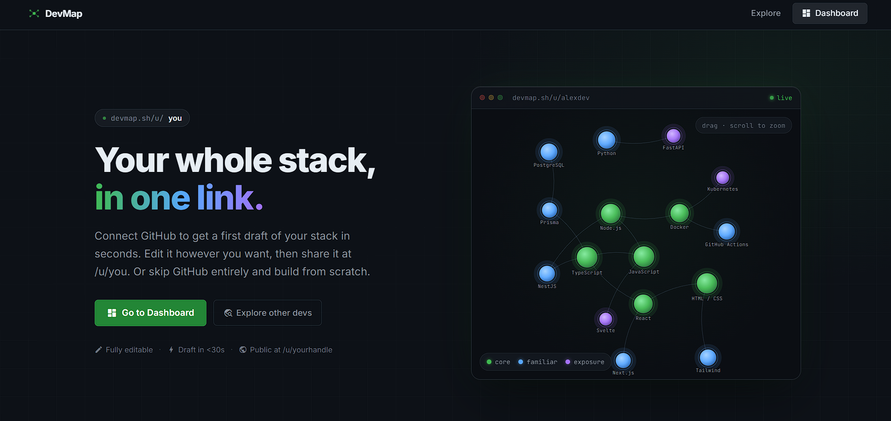
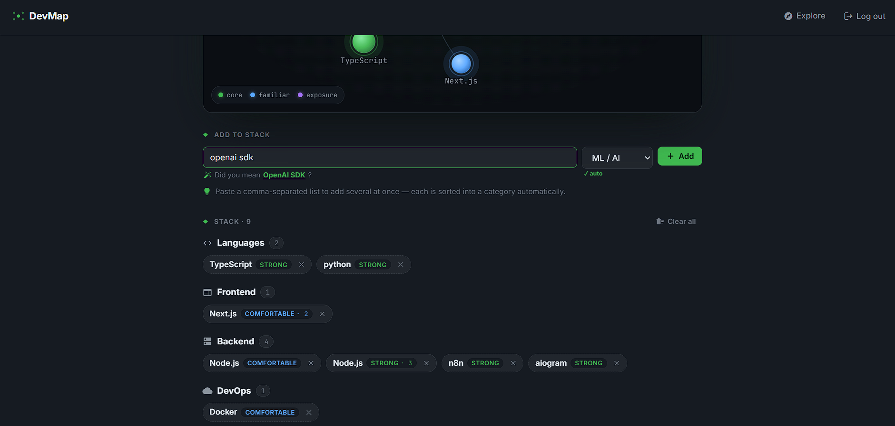
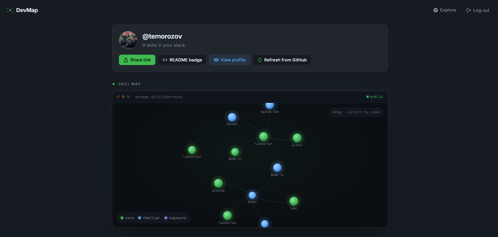
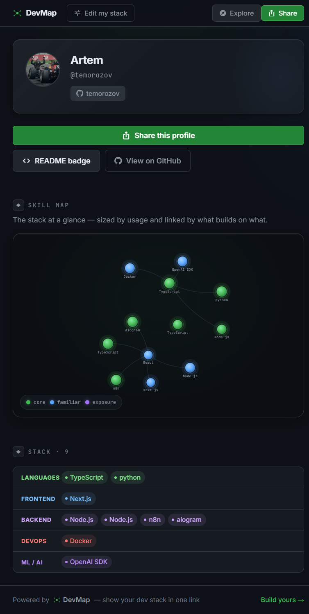
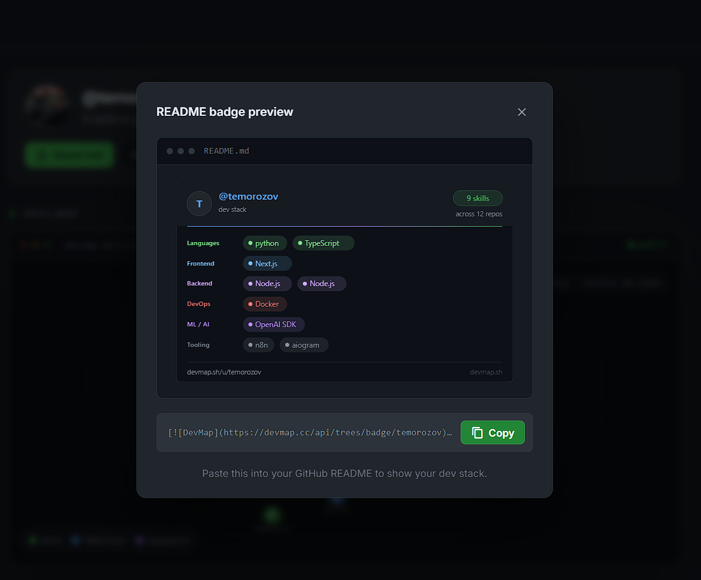
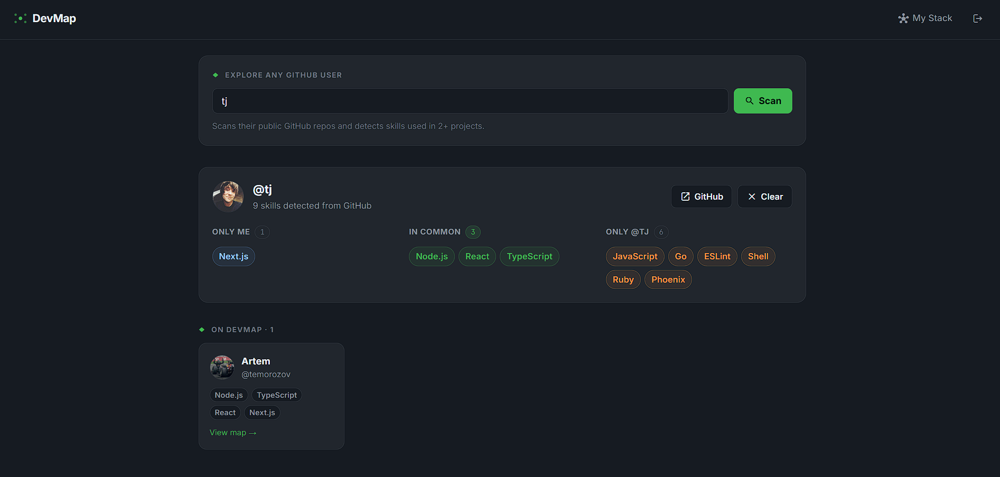

# DevMap

**Show your dev stack, beautifully, in one link.**

Connect GitHub, get an editable map of the technologies you actually work with, and share a public profile at `/u/yourhandle` that recruiters and other devs enjoy looking at.


*The landing page: what a visitor sees before signing in.*

---

## How it works

### 1. Connect GitHub, get a draft for free

DevMap scans your repositories (`package.json`, Dockerfiles, CI workflows, and more) and detects over 50 technologies. Those become an editable starting point, not a verdict. "Used in N repos" shows up as a quiet badge, never a gate.


*What a fresh scan looks like: grouped by category, levels already guessed, nothing locked.*

### 2. Edit it until it's actually yours

Add the skills the scan missed, drop the ones that don't represent you anymore, set your own levels. "Refresh from GitHub" re-scans on demand without touching what you've edited by hand.


*The dashboard: your stack, your call.*

### 3. Share a profile worth sharing

Your public profile at `/u/handle` pairs a clean user card with an interactive skill map and your stack grouped by category, plus an OG preview that looks right when someone shares it on Slack or Twitter.


*A public DevMap profile end to end: card, skill map, and stack grouped by category.*

### 4. Drop a badge in your README

```md
[](https://yourhost/u/handle)
```

It renders as a live SVG of your stack, generated on the fly.


*The badge rendered inside a GitHub README.*

### 5. Explore and compare

Search any public GitHub user, not just DevMap members, and watch their stack get drafted live. If you're logged in, you can diff someone else's stack against your own, side by side.


*Comparing stacks side by side in Explore: what you share, and what's just theirs.*

---

## Stack

- Frontend: Angular 18, SCSS, OnPush
- Backend: NestJS 10
- Database: PostgreSQL + Prisma 7
- Email: Resend
- Monorepo: Nx
- Runtime: Docker Compose

---

## Running it locally

```sh
# Dev (local Node + Docker Postgres)
npm run dev        # start, frontend on :4200, backend on :3000/api
npm run dev:down   # stop Docker services

# Prod
npm run prod       # build + deploy
npm run prod:down  # stop

# Code
npm run format     # format all files
npm run lint       # lint
npm run test       # tests
```

`npm run prod` validates env, builds containers, and runs `prisma migrate deploy` automatically.

> **First deploy:** `cp .env.production.example .env.production` and fill in the values.

---

## Key env vars

| Variable | Required | Purpose |
|----------|----------|---------|
| `JWT_SECRET` | yes | JWT signing |
| `DATABASE_URL` | yes | Postgres connection |
| `FRONTEND_URL` / `BACKEND_URL` | yes | Public URLs (badge + OG image links) |
| `GITHUB_CLIENT_ID` / `GITHUB_CLIENT_SECRET` | yes | GitHub OAuth login + repo scanning |
| `GITHUB_CALLBACK_URL` | yes | OAuth redirect |
| `RESEND_API_KEY` | optional | Email (degrades gracefully without it) |

See `.env.example` and `docs/DEPLOYMENT_INSTRUCTIONS.md` for the full list.

---

## Docs

- [Project Context](docs/PROJECT_CONTEXT.md)
- [Deployment](docs/DEPLOYMENT_INSTRUCTIONS.md)
- [Roadmap](docs/ROADMAP.md)
- [Agent Guidelines](docs/AGENTS.md)
